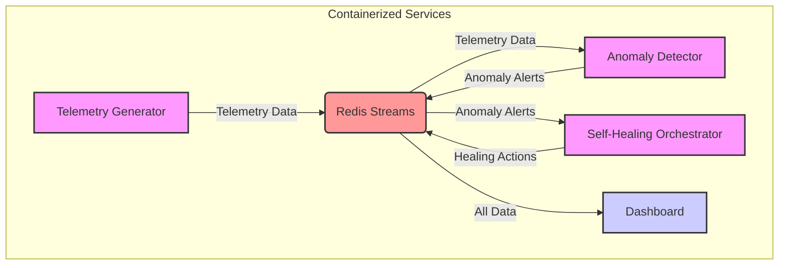

# Self-Healing-POC-for-Distributed-Systems

This project is a prototype of a simple AI-driven "self-healing" system capable of autonomously detecting anomalies in simulated system telemetry and triggering predefined recovery actions. It demonstrates a proactive approach to operational excellence, reducing Mean Time To Recovery (MTTR) and minimizing human intervention in the face of common infrastructure failures.


## Architecture

The system is composed of several microservices that communicate via Redis streams:

1.  **Telemetry Generator (`telemetry_generator.py`)**: Simulates system metrics (CPU, memory, etc.) for multiple services and injects anomalies. It publishes this data to a Redis stream.
2.  **Anomaly Detector (`anomaly_detector.py`)**: Ingests telemetry data from Redis, uses an unsupervised machine learning model (Isolation Forest) to detect anomalies, and publishes alerts to another Redis stream.
3.  **Self-Healing Orchestrator (`self_healing_orchestrator.py`)**: Subscribes to anomaly alerts. Based on a simple rulebook, it triggers mock recovery actions (e.g., "restarting a service") and logs these actions to a Redis stream.
4.  **Dashboard (`dashboard.py`)**: A Streamlit application that provides a real-time view of the system. It visualizes telemetry, highlights detected anomalies, and displays a log of recovery actions.
5.  **Redis**: Acts as the message broker and data store for telemetry, anomalies, and actions.

## How it Works



## Getting Started

### Prerequisites

- Docker
- Docker Compose

### Running the System

1.  Clone the repository.
2.  Navigate to the `Self-Healing-POC-for-Distributed-Systems` directory.
3.  Run the following command to build and start all services:
    ```bash
    docker-compose up --build
    ```
4.  Open a web browser and go to `http://localhost:8501` (streamlit) to view the dashboard.

## Technical Choices

-   **Python**: For its simplicity.
-   **Scikit-learn**: For the `IsolationForest` anomaly detection model.
-   **Streamlit**: For rapid development of the interactive dashboard.
-   **Redis**: For lightweight and fast inter-service communication.
-   **Docker & Docker Compose**: For containerizing the application, ensuring a consistent and reproducible environment. 